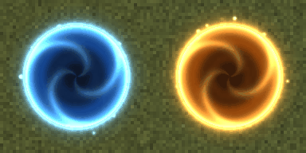

# Portal Guns — портальные пушки для Factorio 2.0




[English below](#english)

Ручная портальная пушка в духе Portal. Левый клик — синий портал, правый — оранжевый. Всё, что входит в
один портал, выходит из другого: вы сами, машина или танк **на той же скорости**, паукотрон, а ещё кусаки,
если они забредут в портал (или если вы их туда заманите).

## Возможности
- **Пушка — настоящий инструмент в руке.** Выстрел летит снарядом, портал открывается там, где он
  приземлился. Если выстрел попал в дерево, камень или угол здания, портал соскальзывает рядом (до 2 клеток).
  На воде, лаве, в космосе, на зданиях, скалах и поверх другого портала он гаснет с искрами.
- **Машины, танки и паукотроны** проходят вместе с пассажирами. Машина сохраняет скорость и направление,
  в том числе при движении задним ходом.
- **Кусаки, плеваки и другие юниты** тоже проходят: откройте синий портал на пути атаки, а оранжевый —
  перед своими турелями. Это можно выключить в настройках.
- **У каждого игрока своя пара.** Повторный выстрел тем же цветом переносит портал. Одиночный портал тусклый
  и вращается медленно, связанная пара — яркая.
- Стоящего в портале в момент открытия второго портала не утягивает: нужно выйти и снова войти. Вышедшего
  из портала не отбрасывает обратно.
- **Между поверхностями (Space Age):** по желанию в настройках. По умолчанию выключено, потому что позволяет
  обойтись без ракет. Так могут перемещаться только персонажи, машины, танки и паукотроны.
- Подписи с именем владельца в режиме дополнительной информации (Alt), свет, звуки, анимация открытия.
- Русская и английская локализация. Рассчитан на мультиплеер: вся логика детерминирована и хранится в
  `storage` (в настоящей сетевой игре не проверялся).

## Управление
| Действие | Клавиши |
|---|---|
| Синий портал | левый клик с пушкой в руке |
| Оранжевый портал | правый клик с пушкой в руке |
| Закрыть портал этого цвета | Shift + левый / правый клик |
| Закрыть оба своих портала | кнопка на панели быстрого доступа или **Alt + P** |
| Закрыть чужой или свой портал | разобрать его (правая кнопка мыши без пушки) |

## Как получить
Технология **«Портальная пушка»** (после технологий «Химический исследовательский пакет» и «Аккумулятор»):
200 × (красный + зелёный + синий пакет), 30 с. Рецепт: 20 продвинутых схем, 10 аккумуляторов, 10 стальных
балок, 10 с. Для теста в песочнице: `/c game.player.insert{name = "portal-gun"}`.

## Настройки карты
| Настройка | По умолчанию |
|---|---|
| Дальность портальной пушки | 50 клеток (10–500) |
| Транспорт проходит через порталы | да |
| Кусаки и другие юниты проходят через порталы | да |
| Связывать порталы между поверхностями | нет |
| Показывать владельцев порталов в режиме доп. информации (Alt) | да |

## Установка
Скопируйте папку `portal-guns` (или `dist/portal-guns_1.0.0.zip` после сборки) в папку `mods` Factorio и
включите мод. Нужна Factorio **2.0** (проверено на 2.0.77). Space Age не обязателен.

## Для авторов сценариев и модов
Интерфейс `remote.call("portal-guns", ...)`:

| Функция | Что делает |
|---|---|
| `open_portal(owner, color, surface, position)` | открыть или перенести портал сразу; вернёт id или `nil, "fizzle"/"too-close"` |
| `fire(owner, color, surface, origin, target, shooter?)` | выстрел со снарядом; портал откроется при попадании; вернёт тик |
| `shoot(...)` | то же, но с правилами пушки: дальность и перезарядка |
| `close_portals(owner, color?)` | закрыть один цвет или оба (и отменить выстрелы в полёте) |
| `get_portal(owner, color)`, `get_portals()` | описание порталов (`entity`, `position`, `linked`, ...) |
| `set_setting(name, value)` | изменить настройку этого мода (другие моды не могут менять чужие настройки) |

`owner` — индекс игрока или любой другой ключ (число или строка) для порталов, не принадлежащих игроку.
После каждого прохода через портал вызывается событие `"portal-guns-on-teleported"`
(`script.on_event("portal-guns-on-teleported", handler)`) с полями `entity`, `owner`, `from_portal`,
`to_portal`, `cross_surface`.

## Как это сделано
Мод сделан по циклу скилла [universal-modder](https://github.com/rehan-remade/universal-modder)
(`mod-any-game`): разведка → выбор пути → лаборатория → чтение исходников → первый рабочий срез → ассеты →
проверка в настоящей игре → упаковка → заметка для базы знаний.

- **Путь:** официальный Lua API Factorio (`data.lua` + `control.lua`), никаких хаков. Журнал:
  [MODLOG.md](MODLOG.md), план: [MODDING_PLAN.md](MODDING_PLAN.md), заметка для базы знаний скилла:
  [docs/field-note.md](docs/field-note.md).
- **Ассеты:** ключа fal не было, поэтому вся графика и звуки сгенерированы процедурно скриптом
  `tools/gen_assets.py` (numpy + Pillow, звуки синтезированы и закодированы ffmpeg в Ogg).
- **Проверка в настоящем движке:** headless-сервер Factorio 2.0.77. `tools/run_tests.py` создаёт карту
  (стадия данных и `on_init`), проверяет все файлы графики и звука по `--dump-data`
  (`tools/check_assets.py`, потому что headless-сервер их не загружает) и прогоняет 24 сценарных теста
  (`tests/portal-guns-tests`) — с базовой игрой и с Space Age + Quality + Elevated Rails. Все зелёные.
- **Производительность:** 100 связанных пар (200 порталов): +0,08 мс/тик, когда рядом никого нет,
  +0,7–0,8 мс/тик, когда у каждого синего портала стоит персонаж (`tools/run_tests.py --perf`).

**Что не проверено:** на выделенном сервере нет игроков, поэтому действия игрока (выстрелы и закрытие
кликами, разбор портала рукой, кнопка на панели, Alt + P, всплывающие надписи) проверены только чтением кода
и документации API, а не в клиенте.
Графику и звук в настоящем клиенте никто не видел и не слышал: проверены пути, размеры листов и
спектрограммы, а превью выше собраны из тех же PNG вне игры.

## Разработка
```bash
uv run tools/gen_assets.py                                    # перегенерировать графику, звуки и превью
python3 tools/run_tests.py --factorio /path/to/bin/x64/factorio [--perf]   # тесты в headless Factorio
python3 tools/build.py                                        # dist/portal-guns_1.0.0.zip
```
Headless-сервер бесплатно скачивается с factorio.com (или из образа `factoriotools/factorio`).

## Авторство и лицензия
Код, графика и звуки — MIT ([LICENSE](LICENSE)). Мод написан ИИ-агентом Claude Code по запросу владельца
репозитория, с использованием скилла universal-modder. Ранее похожую идею для Factorio 0.16–1.1 делал мод
[Portals](https://mods.factorio.com/mods/Bilka/Portals) (Bilka); здесь своя реализация с нуля.

---

## English

A Portal-style handheld portal gun for Factorio 2.0. Left click shoots a blue portal, right click an orange
one. Whatever goes into one comes out of the other: you, your car or tank **at the same speed**,
spidertrons, and biters that wander (or are lured) in.

**Features.** Shots are projectiles; a portal opens where the shot lands, slides up to 2 tiles off small
obstacles and fizzles on water, lava, space, buildings, cliffs or another portal. Vehicles take their
passengers and keep speed and heading (reversing too). Units go through unless disabled. Every player has
their own pair; re-shooting a colour moves that portal. Standing in a portal when its partner opens doesn't
pull you through, and you don't bounce back out of the exit. Cross-surface links (Space Age) are an opt-in
setting. Alt-mode owner labels, lights, sounds, opening animation. English and Russian. Built for multiplayer
(deterministic, all state in `storage`), though not tried in a real multiplayer game.

**Controls.** LMB: blue portal. RMB: orange portal. Shift + LMB/RMB: close that colour. Shortcut button or
Alt + P: close both. Mine a portal to close it.

**Unlock.** Technology "Portal gun" (after Chemical science pack and Battery), 200 × red/green/blue, 30 s.
Recipe: 20 advanced circuits, 10 batteries, 10 steel plates.

**Settings.** Range (50, 10-500), vehicles use portals (on), units use portals (on), cross-surface links
(off), owner labels (on).

**Scripting.** `remote.call("portal-guns", ...)`: `open_portal`, `fire`, `shoot`, `close_portals`,
`get_portal`, `get_portals`, `set_setting`, `get_event_names`; custom event `"portal-guns-on-teleported"`
(`entity`, `owner`, `from_portal`, `to_portal`, `cross_surface`). See the table above.

**How it was built and verified.** Made with the [universal-modder](https://github.com/rehan-remade/universal-modder)
`mod-any-game` loop through Factorio's official Lua API. No fal key was available, so all art and audio is
procedural (`tools/gen_assets.py`). Verified on a real Factorio 2.0.77 headless server: map creation, an asset
check against `--dump-data` (the headless server never loads sprites or sounds), and 24 scripted tests, with the
base game and with Space Age + Quality + Elevated Rails, all passing. 100 linked pairs cost +0.08 ms/tick when
idle and +0.7-0.8 ms/tick with a character at every blue portal. **Not verified:** player actions (clicking to
shoot or close, mining a portal by hand, the shortcut, the keybinding, flying texts), since a dedicated server
has no players,, and how the art and sound look and sound in
the real client. Journal: [MODLOG.md](MODLOG.md); knowledge-base note: [docs/field-note.md](docs/field-note.md).

**License.** MIT. Written by the Claude Code AI agent using the universal-modder skill.
